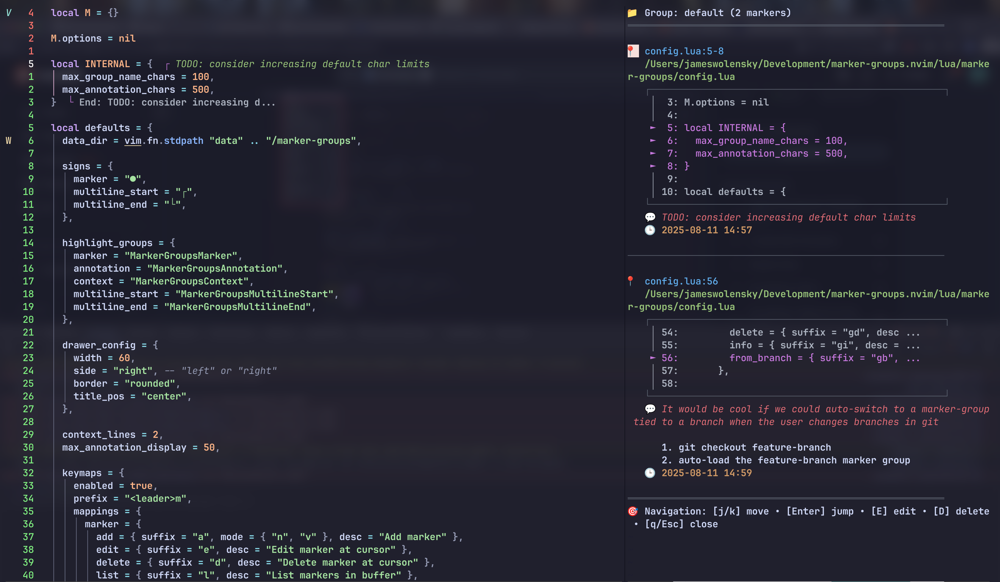

# marker-groups.nvim

A powerful Neovim plugin for organizing and annotating code with grouped markers. Perfect for code reviews, debugging sessions, and project navigation.




## ✨ Features

- **📝 Smart Markers**: Add single-line or multi-line markers with annotations
- **🗂️ Group Organization**: Organize markers into logical groups (features, bugs, todos, etc.)
- **🎯 Visual Indicators**: See markers directly in your code with virtual text
- **🪟 Drawer Viewer**: Right-side drawer to browse all markers with context
- **🔍 Picker Integration**: Use Telescope, Snacks Picker, or mini.pick (auto-detected), with fallback to built-in `vim.ui`
- **💾 Persistent Storage**: Markers survive Neovim restarts with automatic saving
- **⌨️ Rich Keybindings**: Intuitive keymaps for all operations
- **🔧 Configurable**: Extensive customization options

## 📦 Installation

### Using [lazy.nvim](https://github.com/folke/lazy.nvim)

```lua
{
  "jameswolensky/marker-groups.nvim",
  dependencies = {
    "nvim-lua/plenary.nvim", -- Required
    "nvim-telescope/telescope.nvim", -- Optional: Telescope picker
    "folke/snacks.nvim",              -- Optional: Snacks picker
    "echasnovski/mini.pick",          -- Optional: mini.pick
  },
  config = function()
    require("marker-groups").setup({
      -- Your configuration here
    })
  end,
}
```

### Using [packer.nvim](https://github.com/wbthomason/packer.nvim)

```lua
use {
  "jameswolensky/marker-groups.nvim",
  requires = {
    "nvim-lua/plenary.nvim", -- Required
    "nvim-telescope/telescope.nvim", -- Optional: Telescope
    "folke/snacks.nvim",             -- Optional: Snacks
    "echasnovski/mini.pick",         -- Optional: mini.pick
  },
  config = function()
    require("marker-groups").setup()
  end,
}
```

## 🚀 Quick Start

```lua
-- Basic setup with defaults
require("marker-groups").setup()

-- Create a new group
:MarkerGroupsCreate feature-auth

-- Add a marker at current line
:MarkerAdd Implement JWT token validation

-- View all markers in drawer viewer
:MarkerGroupsView

-- List all groups
:MarkerGroupsList
```

## ⌨️ Default Keybindings

| Keymap | Action | Description |
|--------|--------|-------------|
| `<leader>ma` | Add marker | Add marker at cursor or visual selection |
| `<leader>mv` | View markers | Toggle drawer marker viewer |
| `<leader>mgc` | Create group | Create a new marker group |
| `<leader>mgl` | List groups | List all marker groups |
| `<leader>mgs` | Select group | Switch to a different group |
| `<leader>mgr` | Rename group | Rename the current group |
| `<leader>mgd` | Delete group | Delete a marker group |
| `<leader>mpg` | Picker groups | Open configured picker for groups |
| `<leader>mpm` | Picker markers | Open configured picker for active group |
| `J/K` in drawer | — | — |
| `E` in drawer | Edit annotation | Edit the selected marker's annotation in the drawer |
| `D` in drawer | Delete marker | Delete the selected marker in the drawer |

## 📖 Commands

### Group Management
- `:MarkerGroupsCreate <name>` - Create a new group
- `:MarkerGroupsList` - List all groups
- `:MarkerGroupsSelect [name]` - Switch to a group
- `:MarkerGroupsRename <old> <new>` - Rename a group
- `:MarkerGroupsDelete <name>` - Delete a group

### Marker Operations
- `:MarkerAdd [annotation]` - Add marker at cursor/selection
- `:MarkerRemove` - Remove marker at cursor
- `:MarkerList` - List markers in current buffer
 

### Viewing & Navigation
- `:MarkerGroupsView` - Open the drawer marker viewer
- `:MarkerGroupsPicker` - Open configured picker (auto/telescope/snacks/mini)
- `:MarkerGroupsPickerMarkers` - Open configured picker for markers
- `:MarkerGroupsTelescope` - Open Telescope integration
- `:MarkerGroupsHealth` - Run health checks

## ⚙️ Configuration

```lua
require("marker-groups").setup({
  -- Picker integration
  picker = {
    -- "auto" | "telescope" | "snacks" | "mini" | "vim"
    provider = "auto",
  },
  -- Persistence
  data_dir = vim.fn.stdpath("data") .. "/marker-groups",

  -- Logging
  debug = false,
  log_level = "info", -- "debug" | "info" | "warn" | "error"

  -- Drawer viewer
  drawer_config = {
    width = 60,        -- 30..120
    side = "right",    -- "left" | "right"
    border = "rounded",
    title_pos = "center",
  },

  -- Context shown around markers in viewer/preview
  context_lines = 2,

  -- Virtual text display & highlight groups
  max_annotation_display = 50, -- truncate long annotations
  -- Customize highlight groups (names). These will be used for rendering.
  -- Provide your own groups to integrate with your colorscheme.
  highlight_groups = {
    marker = "MarkerGroupsMarker",
    annotation = "MarkerGroupsAnnotation",
    context = "MarkerGroupsContext",
    multiline_start = "MarkerGroupsMultilineStart",
    multiline_end = "MarkerGroupsMultilineEnd",
  },

  -- Keybindings (declarative; override per entry or disable by setting to false)
  keymaps = {
    enabled = true,
    prefix = "<leader>m",
    mappings = {
      marker = {
        add = { suffix = "a", mode = { "n", "v" }, desc = "Add marker" },
        edit = { suffix = "e", desc = "Edit marker at cursor" },
        delete = { suffix = "d", desc = "Delete marker at cursor" },
        list = { suffix = "l", desc = "List markers in buffer" },
        info = { suffix = "i", desc = "Show marker at cursor" },
        
      },
      group = {
        create = { suffix = "gc", desc = "Create marker group" },
        select = { suffix = "gs", desc = "Select marker group" },
        list = { suffix = "gl", desc = "List marker groups" },
        rename = { suffix = "gr", desc = "Rename marker group" },
        delete = { suffix = "gd", desc = "Delete marker group" },
        info = { suffix = "gi", desc = "Show active group info" },
        -- next/prev/toggle_last/cleanup removed
        from_branch = { suffix = "gb", desc = "Create group from git branch" },
      },
      view = {
        toggle = { suffix = "v", desc = "Toggle drawer marker viewer" },
      },
      picker = {
        groups = { suffix = "pg", desc = "Picker: marker groups" },
        markers = { suffix = "pm", desc = "Picker: markers in active group" },
      },
      telescope = {
        groups = { suffix = "tg", desc = "Telescope: marker groups" },
        markers = { suffix = "tm", desc = "Telescope: markers in active group" },
      },
    },
  },
})
```

### Limits

- Annotations: up to 500 UTF‑8 characters. Inputs longer than this are truncated in command prompts/args.
- Group names: up to 100 UTF‑8 characters. Longer names are truncated in command prompts/args.

## 🎯 Use Cases

### Code Reviews
```lua
-- Create a group for review comments
:MarkerGroupsCreate code-review

-- Add markers for issues found
:MarkerAdd TODO: Extract this function
:MarkerAdd FIXME: Handle edge case for empty array
:MarkerAdd NOTE: Consider performance optimization
```

### Feature Development
```lua
-- Organize by feature branches
:MarkerGroupsCreate feature-user-auth
:MarkerAdd Implement login endpoint
:MarkerAdd Add password validation
:MarkerAdd Create user session management
```

### Bug Tracking
```lua
-- Track bugs and fixes
:MarkerGroupsCreate bug-fixes
:MarkerAdd BUG: Memory leak in data processing
:MarkerAdd FIX: Null pointer exception handling
```

## 🔍 Floating Window Navigation

The drawer viewer provides rich, buffer-local navigation:

- **`j/k`** or **`↑/↓`** - Navigate between markers
- **`Enter`** - Jump to marker location
  
- **`E`** - Edit the selected marker’s annotation
- **`D`** - Delete the selected marker
- **`q/Esc`** - Close window
 

Note:
- `<leader>md` deletes the marker at cursor in regular file buffers. Inside the drawer, `<leader>md` is intentionally disabled; use `D` for delete and `E` for edit.

## 🧪 Health Checks

Run `:MarkerGroupsHealth` to verify:
- ✅ Neovim version compatibility
- ✅ Required dependencies
- ✅ Plugin initialization
- ✅ Data directory accessibility
- ✅ Configuration validity

## 🤝 Contributing

Contributions are welcome! Please see [CONTRIBUTING.md](CONTRIBUTING.md) for development setup and guidelines.

## 📄 License

MIT License - see [LICENSE](LICENSE) file for details.

## 🙏 Acknowledgments

- Built with [plenary.nvim](https://github.com/nvim-lua/plenary.nvim)
- Telescope integration via [telescope.nvim](https://github.com/nvim-telescope/telescope.nvim)
- Inspired by various code annotation and marker plugins
